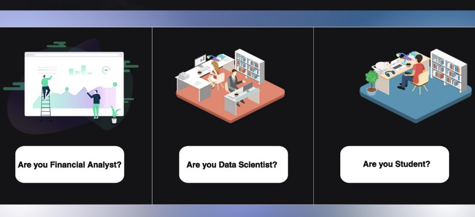
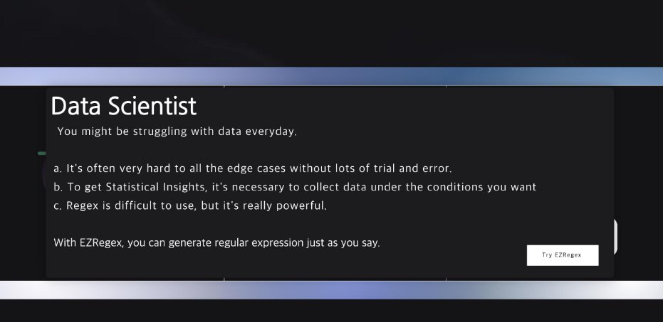
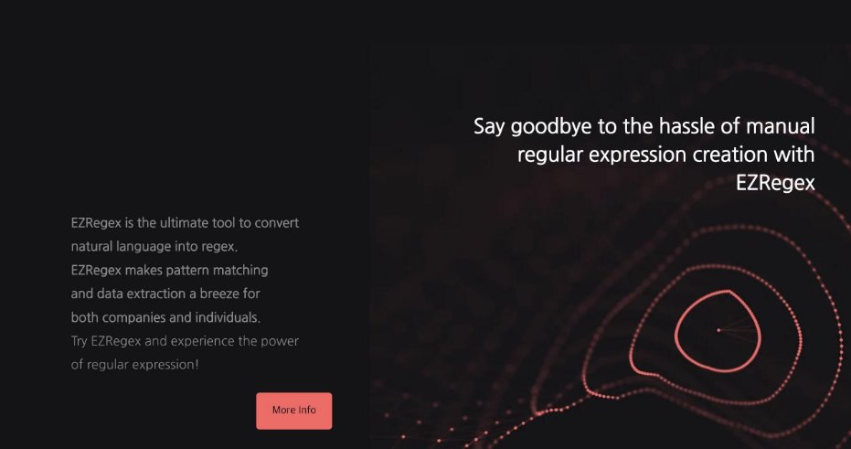
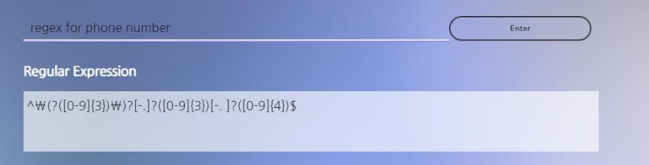
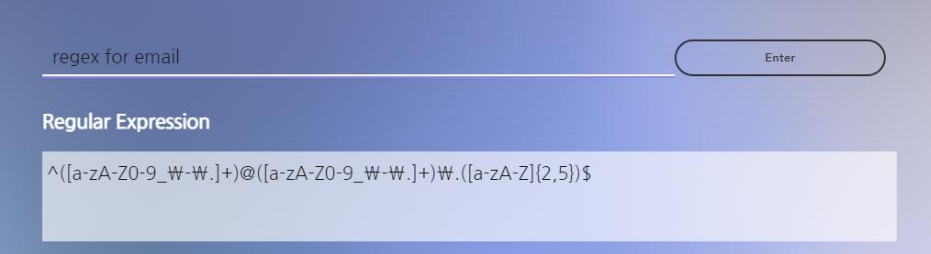
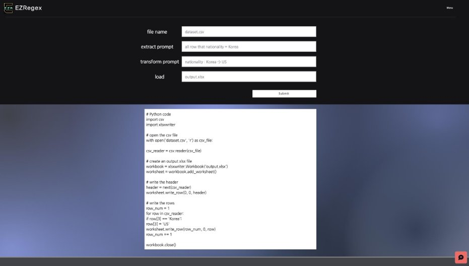
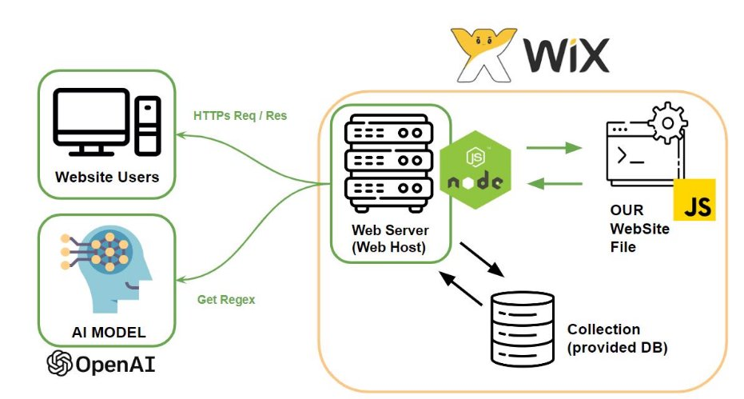
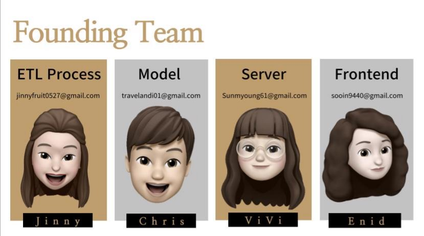

**Technical Spec**

Team 4, EZRegex Date : FEB, 8, 2023 

1. **Introduction**

If you are not familiar with regular expressions, you can still generate patterns for text matching by using a regex generator tool. A EZRegex can help you construct a regex pattern by providing a simple and intuitive user interface, where you can specify the criteria for your search and see the equivalent regex pattern in real-time.

2. **Functionality & Advantages**

Key Feature

EZRegex is Regex generator tool that also includes ETL (Extract, Transform, Load) functions, can be a very useful tool for working with text data. This is very easy to use, use input that what certain regex did user wants, then input comes out the result(regex). Also in ETL process, input the text that would be applied regex, and the word that you want to change, then output is the text that changed with the word that you input.

Advantages

The combination of regex and ETL capabilities can allow you to automate many text processing tasks, such as:

- Extracting specific pieces of information from a large text document
  - Cleaning and transforming text data to make it more consistent and usable
    - Loading the processed text data into a database or other data storage system

This can be especially useful for working with large or complex text datasets, as it can help you to streamline the data processing and preparation process, saving you time and effort.

**User Interface**

 Landings 

Generating Regex

ETL process

**Techincal Details**

Whole process

After modifying the web-hosted page as we want, we use the API to communicate with the model using nodejs to communicate with the web server.

- Backend: Nodejs, JS, Collection (for DB), Wix-APIs
  - Frontend : JS, Wix-editor

Model

- OpenAI ("**text-davinci-003**”)
  - Ensemble, especially in  **TDA (Test-time Data augmentation)** : According to  『 Improved Text Classification via T est-Time Augmentation 』 TTA(TDA) can be used to improve model performance p ost-hoc, without additional training. It has seen limited adoption in NLP due in part to the difficulty of identifying label-preserving transformations, but also has a considerable impact on the benefit of TTA(TDA)
    - Prompt Design : There is guideline for making a prompt to use our program better. This is original promp design , but we can also provide already-made prompt

**Performance**

 Site speed (site's loading metrics over the last 30 days: Jan 11 - Feb 9)

Checked by  Chrome User Experience Report

The site's initial content pool paint must be less than 1.8 seconds to provide a good user experience, and the site's maximum content pool paint must be less than 2.5 seconds to provide a good user experience. Our FCP, LCP score are good enough **when applying these criteria to use the page.**

Model

- **Model-confidence score** (with Hard Voting) : Each model fused with the concept of model certainty by simply choosing the result with the most votes when each model predicts the result.
  - 1 point: Request to write the prompt in more detail.
    - 2 or more points: output derived

**Future plan**

- Model improvement with fine-tuning, Data Augmentation
  - Provide storage Fuction for uploading and downloading files
    - Security Features

**Teams**

Technical Spec 6
